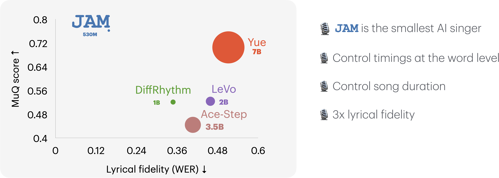
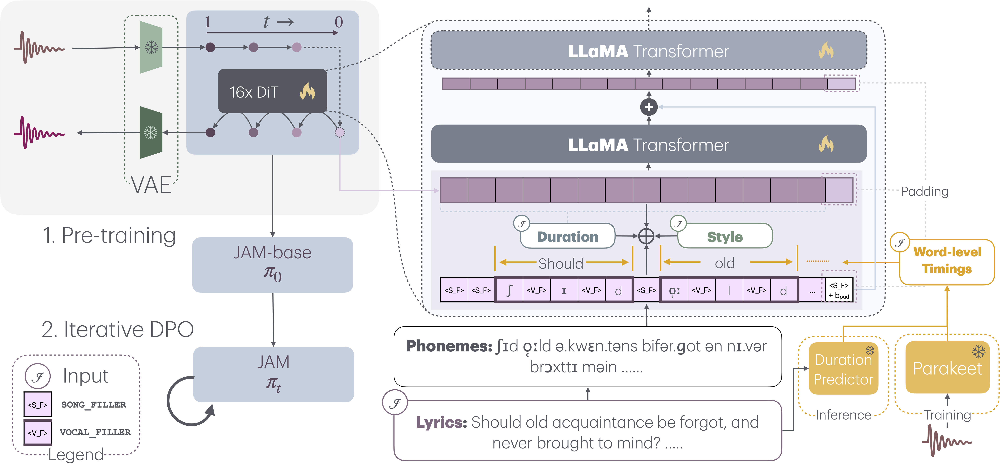

<div align="center">
  
 <br/>
  <h1>JAM: A Tiny Flow-based Song Generator with Fine-grained Controllability and Aesthetic Alignment</h1>
  <br/>
 
  [](https://arxiv.org/abs/2507.20880) [](https://huggingface.co/declare-lab/JAM-0.5) [](https://huggingface.co/datasets/declare-lab/JAME) [](https://huggingface.co/spaces/declare-lab/JAM) [](https://github.com/declare-lab/jamify) [](https://declare-lab.github.io/jamify) 
 
</div>


JAM is a rectified flow-based model for lyrics-to-song generation that addresses the lack of fine-grained word-level controllability in existing lyrics-to-song models. Built on a compact 530M-parameter architecture with 16 LLaMA-style Transformer layers as the Diffusion Transformer (DiT) backbone, JAM enables precise vocal control that musicians desire in their workflows. Unlike previous models, JAM provides word and phoneme-level timing control, allowing musicians to specify the exact placement of each vocal sound for improved rhythmic flexibility and expressive timing.

## News
> 📣 05/08/25: Training code has been released! You can now train your own JAM models from scratch.

> 📣 29/07/25: We have released JAM-0.5, the first version of the AI song generator from Project Jamify!


## Features



- **Fine-grained Word and Phoneme-level Timing Control**: The first model to provide word-level timing and duration control in song generation, enabling precise prosody control for musicians
- **Compact 530M Parameter Architecture**: Less than half the size of existing models, enabling faster inference with reduced resource requirements
- **Enhanced Lyric Fidelity**: Achieves over 3× reduction in Word Error Rate (WER) and Phoneme Error Rate (PER) compared to prior work through precise phoneme boundary attention
- **Global Duration Control**: Controllable duration up to 3 minutes and 50 seconds.
- **Aesthetic Alignment through Direct Preference Optimization**: Iterative refinement using synthetic preference datasets to better align with human aesthetic preferences, eliminating manual annotation requirements

## The Pipeline



## Table of Contents

- [JAM Samples](#jam-samples)
- [Requirements](#requirements)
- [Installation](#installation)
- [Quick Start](#quick-start)
- [Inference](#inference)
  - [Command Line Interface](#command-line-interface)
  - [Configuration Options](#configuration-options)
  - [Input File Formats](#input-file-formats)
  - [Output Structure](#output-structure)
- [Training](#training)
  - [Data Formats](#data-formats)
    - [WebDataset Format (Pretrain & SFT)](#webdataset-format-pretrain--sft)
    - [DPO JSON Format](#dpo-json-format)
  - [Training Commands](#training-commands)
    - [Pretraining](#pretraining)
    - [Supervised Fine-tuning (SFT)](#supervised-fine-tuning-sft)
    - [Direct Preference Optimization (DPO)](#direct-preference-optimization-dpo)
  - [Configuration Options](#configuration-options-1)
  - [Monitoring](#monitoring)
- [Troubleshooting](#troubleshooting)
  - [Common Issues](#common-issues)
- [Model Downloads](#model-downloads)
- [Citation](#citation)
- [License](#license)
- [Support](#support)

## JAM Samples

Check out the example generated music in the `generated_examples/` folder to hear what JAM can produce:

- **`Hybrid Minds, Brodie - Heroin.mp3`** - Electronic music with synthesized beats and electronic elements
- **`Jade Bird - Avalanche.mp3`** - Country music with acoustic guitar and folk influences  
- **`Rizzle Kicks, Rachel Chinouriri - Follow Excitement!.mp3`** - Rap music with rhythmic beats and hip-hop style

These samples demonstrate JAM's ability to generate high-quality music across different genres while maintaining vocal intelligence, style consistency and musical coherence.

## Requirements

- Python 3.10 or higher
- CUDA-compatible GPU with sufficient VRAM (8GB+ recommended)


## Installation

### 1. Clone the Repository

```bash
git clone https://github.com/declare-lab/jamify
cd jamify
```

### 2. Run Installation Script

The project includes an automated installation script, run it in your own virtual environment:

```bash
bash install.sh
```

This script will:
- Initialize and update git submodules (DeepPhonemizer)
- Install Python dependencies from `requirements.txt`
- Install the JAM package in editable mode
- Install the DeepPhonemizer external dependency

### 3. Manual Installation (Alternative)

If you prefer manual installation:

```bash
# Initialize submodules
git submodule update --init --recursive

# Install dependencies
pip install -r requirements.txt

# Install JAM package
pip install -e .

# Install DeepPhonemizer
pip install -e externals/DeepPhonemizer
```

## Quick Start

### Simple Inference

The easiest way to run inference is using the provided `inference.py` script:

```python
python inference.py
```

This script will:
1. Download the pre-trained JAM-0.5 model from Hugging Face
2. Run inference with default settings
3. Save generated audio to the `outputs` directory

### Input Format

Create an input file at `inputs/input.json` with your songs:

```json
[
  {
    "id": "my_song",
    "audio_path": "inputs/reference_audio.mp3",
    "lrc_path": "inputs/lyrics.json", 
    "duration": 180.0,
    "prompt_path": "inputs/style_prompt.txt"
  }
]
```

Required files:
- **Audio file**: Reference audio for style extraction
- **Lyrics file**: JSON with timestamped lyrics
- **Prompt file**: Text description of desired style/genre. Text prompt is not used in the default setting where the audio reference is utilized.

## Inference

### Using `python -m jam.infer`

For more control over the generation process:

```bash
# Basic usage with custom checkpoint
python -m jam.infer evaluation.checkpoint_path=path/to/model.safetensors

# With custom output directory
python -m jam.infer evaluation.checkpoint_path=path/to/model.safetensors evaluation.output_dir=my_outputs

# With custom configuration file
python -m jam.infer config=configs/my_config.yaml evaluation.checkpoint_path=path/to/model.safetensors
```

### Multi-GPU Inference

Use Accelerate for distributed inference:

```bash
# Basic usage with custom checkpoint
accelerate launch -m jam.infer config=configs/jam_infer.yaml

# With custom configuration file
accelerate launch -m jam.infer config=configs/jam_infer.yaml
```

### Configuration Options

#### Evaluation Settings
- `evaluation.checkpoint_path`: Path to model checkpoint (required)
- `evaluation.output_dir`: Output directory (default: "outputs")
- `evaluation.test_set_path`: Input JSON file (default: "inputs/input.json")
- `evaluation.batch_size`: Batch size for inference (default: 1)
- `evaluation.num_samples`: Only generate first n samples in test_set_path (null = all)
- `evaluation.vae_type`: VAE model type ("diffrhythm" or "stable_audio")

#### Style Control
- `evaluation.ignore_style`: Ignore style prompts (default: false)
- `evaluation.use_prompt_style`: Use text prompts for style (default: false)
- `evaluation.num_style_secs`: Style audio duration in seconds (default: 30)
- `evaluation.random_crop_style`: Randomly crop style audio (default: false)

### Input File Formats

#### Lyrics File (`*.json`)
```json
[
    {"start": 2.2, "end": 2.5, "word": "First word of lyrics"},
    {"start": 2.5, "end": 3.7, "word": "Second word of lyrics"},
    {"more lines ...."}
]
```

#### Style Prompt File (`*.txt`)
```
Electronic dance music with heavy bass and synthesizers
```

#### Input Manifest (`input.json`)
```json
[
  {
    "id": "unique_song_id",
    "audio_path": "path/to/reference.mp3",
    "lrc_path": "path/to/lyrics.json",
    "duration": 180.0,
    "prompt_path": "path/to/style.txt"
  }
]
```

### Output Structure

Generated files are saved to the output directory:

```
outputs/
├── generated/          # Final trimmed audio files
├── generated_orig/     # Original generated audio
├── cfm_latents/       # Intermediate latent representations
├── local_files/       # Process-specific metadata
└── generation_config.yaml  # Configuration used for generation
```

## Training

JAM supports three training stages: pretraining, supervised fine-tuning (SFT), and direct preference optimization (DPO). Each stage requires specific data formats and training commands.

### Data Formats

#### WebDataset Format (Pretrain & SFT)

For pretraining and SFT, JAM expects data in WebDataset format - tar files containing:

```
your_dataset-000000.tar
├── song_id_1/
│   ├── latent.pt      # Audio latent representation (torch tensor)
│   ├── style.pt       # MuQ style embedding (torch tensor, 512-dim or n*512-dim)  
│   └── json           # Metadata with phoneme information
├── song_id_2/
│   ├── latent.pt
│   ├── style.pt
│   └── json
└── ...
```

**JSON Structure:**
```json
{
  "word": [
    {"start": 2.2, "end": 2.5, "phoneme": "ˈfɜrst"},
    {"start": 2.5, "end": 3.7, "phoneme": "wɜrd"},
    ...
  ]
}
```

**ID List JSONL (Optional):**
When provided via `id_list_jsonl`, enables advanced filtering and sampling:
```jsonl
{"id": "song_id_1", "duration": 180.5}
{"id": "song_id_2", "duration": 95.2}
```

Features when ID list is provided:
- Filter training to specific song IDs
- Duration-based sampling (`resample_by_duration_threshold`)
- Duration filtering (`ignore_by_duration_threshold`)

**Style Embeddings:**
Style embeddings are precomputed MuQ (Music Understanding Query) representations:
- **Single Style**: 512-dimensional tensor when `multiple_styles: false`
- **Multiple Styles**: n×512-dimensional tensor when `multiple_styles: true`
  - During training, one random style is selected from the n available styles
  - Enables style variation and data augmentation

#### DPO JSON Format

For DPO training, provide a JSON file with preference pairs:

```json
[
  {
    "win_latent": "path/to/preferred_latent.pt",
    "loss_latent": "path/to/dispreferred_latent.pt", 
    "transcription": "path/to/lyrics.json",
    "style": "path/to/style.pt",
    "gt_latent": "path/to/ground_truth.pt"
  }
]
```

**Required Fields:**
- `win_latent`: Path to preferred latent representation
- `loss_latent`: Path to dispreferred latent representation  
- `transcription`: Path to JSON file with lyrics/phoneme data (same format as WebDataset JSON)
- `style`: Path to MuQ style embedding (same format as WebDataset style.pt)

**Conditional Fields:**
- `gt_latent`: Required when DPO mode is set to "gt" in configuration

### Training Commands

#### Pretraining

```bash
accelerate launch -m jam.train config=configs/pretrain.yaml
```

Key configuration parameters in `configs/pretrain.yaml`:
- `data.train_dataset.pattern`: Path pattern to WebDataset tar files, e.g. `your_jam_dataset-{000000..000485}.tar`
- `data.train_dataset.id_list_jsonl`: Optional ID list for filtering
- `training.max_steps`: Total training steps
- `training.checkpoint_path`: Output directory for checkpoints

#### Supervised Fine-tuning (SFT)

```bash
accelerate launch -m jam.train config=configs/sft.yaml
```

Key differences from pretraining:
- `training.resume_from_safetensors`: Path to pretrained model
- Higher `max_frames` for full-song training
- `model.dit.grad_ckpt: true` for memory efficiency

#### Direct Preference Optimization (DPO)

```bash
accelerate launch -m jam.dpo.train_dpo config=configs/dpo.yaml
```

Key DPO parameters:
- `data.train_dataset.dpo_json_path`: Path to DPO preference data
- `training.resume_from_safetensors`: Path to SFT model
- `training.beta_dpo`: DPO regularization strength
- `model.cfm.sft`: Set to "none" for classic DPO, "gt" for additional sft loss using ground truth latents, "win" if winning candidates are used as ground truth

### Configuration Options

#### Training Parameters
- `max_steps`: Total training steps
- `learning_rate`: Learning rate (typically 7.5e-5 for pretrain/SFT, 5.0e-7 for DPO)
- `grad_accumulation_steps`: Gradient accumulation steps
- `save_per_updates`: Checkpoint saving frequency

#### Data Parameters  
- `max_frames`: Maximum sequence length
- `batch_size`: Training batch size
- `shuffle`: Whether to shuffle training data
- `multiple_styles`: Whether to use multiple style embeddings (n×512-dim) with random selection

#### Model Parameters
- `grad_ckpt`: Enable gradient checkpointing for memory efficiency
- `dual_drop_prob`: Dual dropout probabilities for CFM training

### Monitoring

Training progress is logged to Weights & Biases. Configure in your YAML:

```yaml
wandb:
  project: "JAM"
  name: "my_training_run" 
  mode: online  # or offline
```

## Troubleshooting

### Common Issues

#### "Checkpoint path not found"
```bash
# Make sure to specify the checkpoint path
python -m jam.infer evaluation.checkpoint_path=path/to/your/model.safetensors
```

#### "CUDA out of memory"
```bash
# Reduce batch size or use mixed precision
accelerate launch --mixed_precision=fp16 -m jam.infer evaluation.checkpoint_path=model.safetensors
```

#### "Test set not found"
```bash
# Create input.json file in inputs/ directory or specify custom path
python -m jam.infer evaluation.test_set_path=path/to/your/input.json evaluation.checkpoint_path=model.safetensors
```

## Model Downloads

The `inference.py` script automatically downloads the JAM-0.5 model. For manual download:

```python
from huggingface_hub import snapshot_download
model_path = snapshot_download(repo_id="declare-lab/jam-0.5")
```
## Citation

If you use JAM in your research, please cite:

```bibtex
@misc{liu2025jamtinyflowbasedsong,
      title={JAM: A Tiny Flow-based Song Generator with Fine-grained Controllability and Aesthetic Alignment}, 
      author={Renhang Liu and Chia-Yu Hung and Navonil Majumder and Taylor Gautreaux and Amir Ali Bagherzadeh and Chuan Li and Dorien Herremans and Soujanya Poria},
      year={2025},
      eprint={2507.20880},
      archivePrefix={arXiv},
      primaryClass={cs.SD},
      url={https://arxiv.org/abs/2507.20880}, 
}
```

## License

**JAM** is the first open-sourced model released under **Project Jamify**, developed for facilitating academic research and creative exploration in AI-generated songs from lyrics. The model is subject to:

1. **Project Jamify License**: Intended **solely for non-commercial, academic, and entertainment purposes**
2. **Stability AI Community License Agreement**: Required due to use of Stability AI model components

### Key Restrictions:
- **No copyrighted material** was used in a way that would intentionally infringe on intellectual property rights
- **JAM is not designed** to reproduce or imitate any specific artist, label, or protected work
- Outputs generated by JAM must **not be used to create or disseminate content that violates copyright laws**
- **Commercial use of JAM or its outputs is strictly prohibited**
- **Attribution Required**: Must retain "This Stability AI Model is licensed under the Stability AI Community License, Copyright © Stability AI Ltd. All Rights Reserved."

### Responsibility
Responsibility for the use of the model and its outputs lies entirely with the end user, who must ensure all uses comply with applicable legal and ethical standards.

For complete license terms, see [LICENSE.md](LICENSE.md) and [STABILITY_AI_COMMUNITY_LICENSE.md](STABILITY_AI_COMMUNITY_LICENSE.md).

For questions, concerns, or collaboration inquiries, please contact the Project Jamify team via the official repository.

## Support

For issues and questions:
- Open an issue on GitHub
- Check the troubleshooting section above
- Review the configuration options for parameter tuning 
